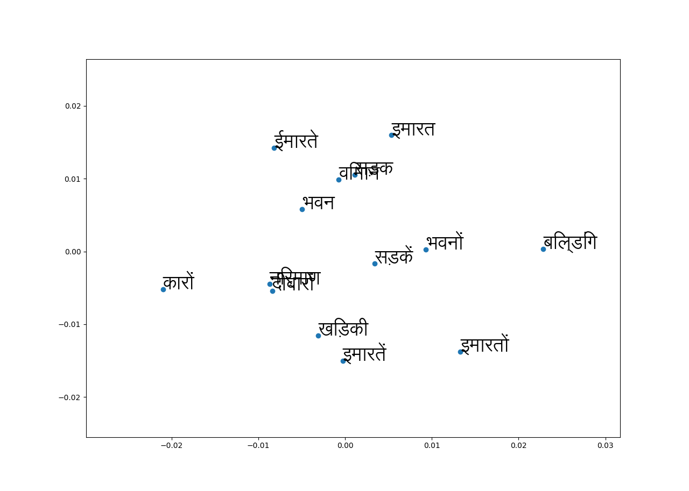

# hindi_nlp
This repository contains the Hindi NLP useful resources.
1.  Python script to Hindi Word Count
2.  Python script to Plot Hindi Word Embedding using PCA

## Getting Started
1.  The script "hindi_wc.py", count the number of words of a Hindi file passed as command line argument. 
During count, it ignores the special characters (e.g. punctuation character "danda" (।)). The script support large file for word count.


### Prerequisites
Python 3.5.0

Usage: Execute the following command on the command line:
```
python hindi_wc.py <infile>
```
```
ex: python hindi_wc.py monolingual.hi
```
2.  The script "hindi_w2v_plot.py", plot the hindi word embedding for a list of Hindi words using PCA.   

Usage: Execute the following command on the command line:
```
python hindi_w2v_plot.py
```

```
example:  
hi_word_list =['इमारतें', 'इमारतों', 'भवन', 'बिल्डिंग', 'सड़कें', 'इमारत', 'भवनों', 'ईमारते', 'सड़क', 'निर्माण', 'खिड़की', 'कारों', 'ईमारते', 'विमान', 'दीवारों',]
```



## Author
Shantipriya Parida


